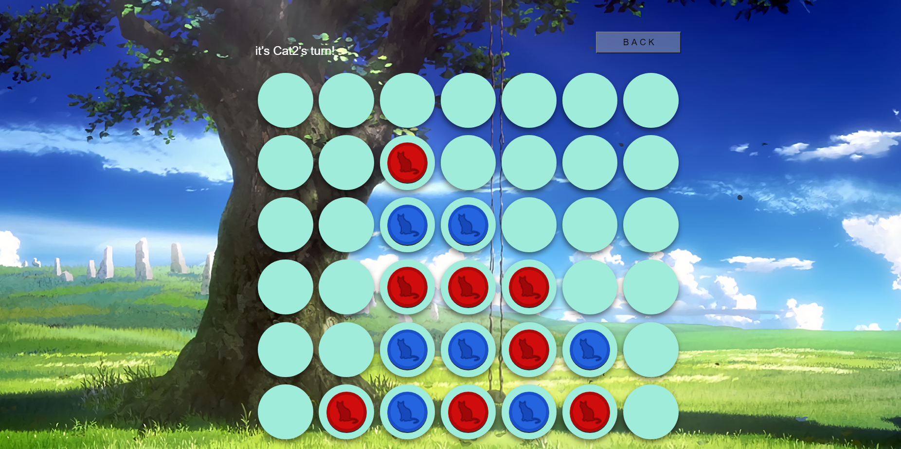
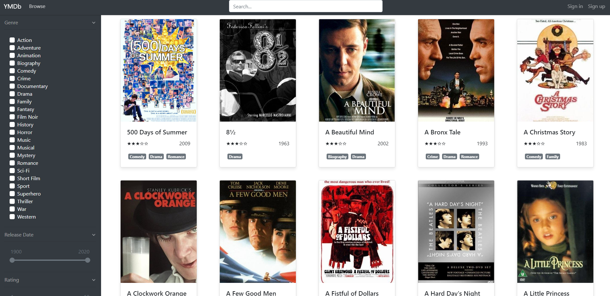
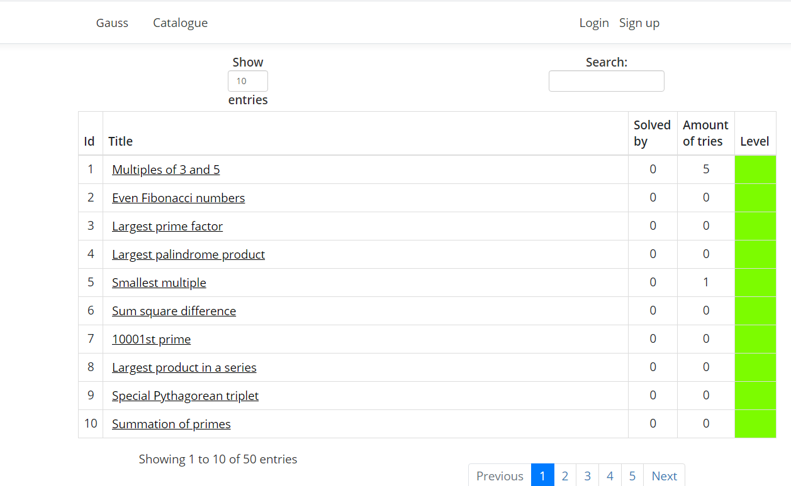

# YoungCapitalNEXT bootcamp with The Academy

This repository contains weekly assignments from TheAcademy.
While I usually don't code in Dutch, some code will be in Dutch due to the dutch nature of the lessons.

## Assignment 1: Webstack Web-App 4-on-a-row game
A simple 4-on-a-row game using the native WebStack
Play the game here: https://hgroenenboom.github.io/YoungCapitalNEXT-bootcamp



### Features
- Leaderboards
- Local caching
- Cross-browser support
- Nice animations
- Fun cat-icon chips
- Fun
- Addictive

### What I learned
- Caching using ```localStorage```
- CSS animations using ```-webkit-animation``` and ```animation```
- using OOP in ES6 javascript

## Assignment 2: Java & OOP
A CLI 'Fair finance' management tool for exploring Java and OOP.
User interface written in Dutch.


<!--### What I learned
From a C++ perspective Java introduces much more strict working with OOP. -->

## Assignment 3: Fullstack development
For the final application me and my team, Wendy and Christian, worked on two fullstack webapplications.
During these projects we were fully responsible for all aspects of fullstack development including:
- Requirements analysis
- Architecture design
- Database design
- Version control
- Server management
- CI/CD
- Team management
- Testing
- Development
etc...

The codebases for these applications are private and are not included in this repository.

### Application 1: YMDB; Youngcapital Movie Database
Visit the final version of this application here: [www.ymdb.nl](http://www.ymdb.nl/)

We chose to develop a fullstack MovieDatabase application using the Spring (Java) and Angular (Frontend) framework. 



For the development of this project we made use of the [imdb](https://www.imdb.com/) database

### Application 2: Gauss; A WebApp full of difficult math related questions.
The final version of this application is not yet available on a public server.

We chose to develop a fullstack application in which teacher can add assigments and student can answer them. The student can track his/her progress and has a simple profile page where the students total progress is shown. We developed this webapp using the Gauss (.NET) and RazorPages (Frontend) framework. 



For this app we were inspired by [Project Euler](https://projecteuler.net/)

## Other; Design Patterns
Exploring the implementations of several design patterns


